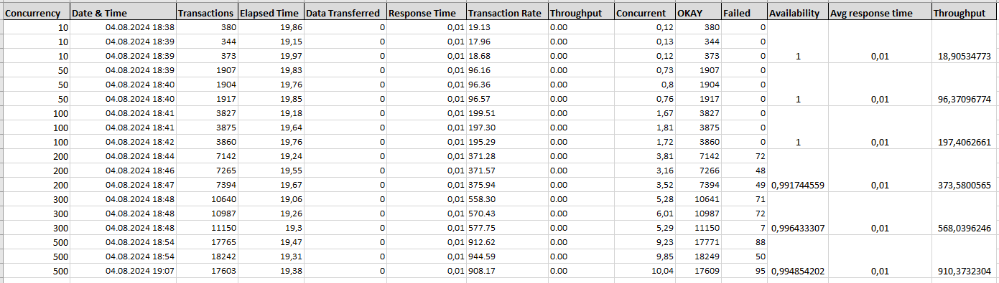

# HSA12 5. Stress Testing. Approaches and tools

## Task Description

The goal of this task is to conduct stress testing of a web application that accepts requests and stores data in a database. The task includes:

1. Create simple web page that accepts requests and stores data from request to database.
2. Prepare siege urls file.
3. Run siege with different concurrency (10, 25, 50, 100).
4. Find resource availability, avg response time, throughput.

## Setup Instructions

### 1. Install Required Software

Make sure you have Docker and Docker Compose installed. If not, install them from the official websites.

### 2. Running Docker Compose

Run the following commands to build and start the Docker containers:

```bash
docker-compose down
docker-compose up
```

### 3. Running the Stress Tests
Run Siege with different concurrency levels to perform the stress tests:

```bash
siege -c10 -t20S -f ./siege/urls.txt --log=logs/log_10.txt
siege -c50 -t20S -f ./siege/urls.txt --log=logs/log_50.txt
siege -c100 -t20S -f ./siege/urls.txt --log=logs/log_100.txt
siege -c200 -t20S -f ./siege/urls.txt --log=logs/log_200.txt
siege -c300 -t20S -f ./siege/urls.txt --log=logs/log_300.txt
siege -c500 -t20S -f ./siege/urls.txt --log=logs/log_500.txt
```

### Results
The results of the stress tests are located in the logs directory, with logs for different levels of concurrency and in the result.xlsx file.


